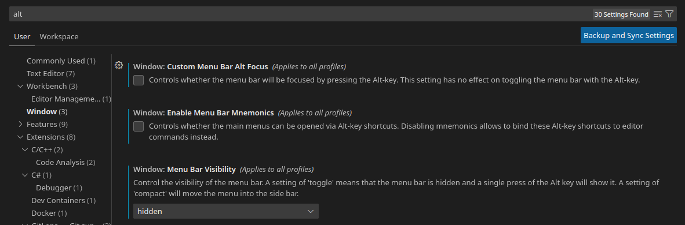

# KeyBridge

Unified ergonomic MacOS-like bindings for GNU Linux and MS Windows

> Learn once, use everywhere

Assume:

| Keyboard key | Behave like        |
|--------------|--------------------|
| Escape       | ⎋ (Escape)         |
| CapsLock     | ⎋ (Escape)         |
| Shift        | ⇧ (Shift)          |
| Ctrl         | ⌃ (Control)        |
| Super (Win)  | ⌥ (Option)         |
| Alt          | ⌘ (Command)        |
| Backspace    | ⌫ (Delete)         |
| Del          | ⌦ (Forward Delete) |

Expect similar behavior on MacOS, GNU Linux and MacOS in general:

- Common keys (⌘-letters)
- Tab navigation (⇧⌘] / ⇧⌘[)
- Mission Control and workspaces (F3, ⌃←, ⌃→, ⌃↑)
- Emacs-like editing (⌃a, ⌃e, ⌃p, ⌃n, ⌃f, ⌃b, ⌃d)
- MacOS-like ⌘-arrows behavior
- Super behave like Alt in terminals
- [Rectangle](https://rectangleapp.com/)-like window snap left/right and maximize (⌃⌥←, ⌃⌥→, ⌃⌥Enter)
- File manager operations (⌘-arrows, ⌘o, ⌘i, enter is rename file)
- VSCode (implemented) and JetBrains IDE (to do)
- Caps is Esc (feel free to change, but it is obviously the best choice)
- Some additional keys (like ⇧⌃-numbers to move window to specific desktop, which is not available in MacOS itself but consistent with ⌃-numbers for switching desktops)

Application-specific shortcuts may vary, but expect at least ⌘-letters.

Setup is focused on two most popular environments:

- Gnome, Wayland (Ubuntu 24.04 perfectly fits)
- Windows 11

It may also work on different GNU Linux desktops if you align default shortcuts and install correct [xremap](https://github.com/xremap/xremap) version, but it is not the priority.

## Installation

### Linux setup

- [install](./install-xremap.sh) [xremap](https://github.com/xremap/xremap)
- install [this](https://extensions.gnome.org/extension/5060/xremap/) **Gnome extension** if use Gnome
- run [pre-setup script](./pre-setup-linux.sh)
- download xremap config named [linux.yml](./linux.yml)
- add xremap with config to autorun

```bash
#!/bin/bash

# get repo
mkdir -p ~/.config
git clone https://github.com/XelorR/KeyBridge ~/.config/keybridge

# setup system shortcuts to ensure compatibility
bash ~/.config/keybridge/pre-setup-linux.sh

# install keymapping software
bash ~/.config/keybridge/install-xremap.sh

# enable service
systemctl enable --now --user keybridge

# you may nee to reboot then
```

If you use [VSCodium](https://vscodium.com/) or [VSCode](https://code.visualstudio.com/), you should also disable Alt focusing to menu bar:



### Windows setup

- manually add 9 desktops (to have 10 in total)
- install [autohotkey v2](https://www.autohotkey.com/v2/)
- download ahkv2 config named [windows.ahk](./windows.ahk)
- place config to `shell:startup` and run it

```powershell
# install package manager
Set-ExecutionPolicy -ExecutionPolicy RemoteSigned -Scope CurrentUser
Invoke-RestMethod -Uri https://get.scoop.sh | Invoke-Expression

# install keymapping software
scoop install git
scoop bucket add extras
scoop install autohotkey

# download the config
git clone https://github.com/XelorR/KeyBridge $env:LOCALAPPDATA/keybridge

# add to autorun
# ...

# run
# ...
```
### MacOS setup

- install [Rectangle](https://rectangleapp.com/), use defaults
- change CapsLock to Escape in settings
- change layout switching to Option-Space (to behave like Super-Space on Linux/Windows)
- change screenshot hotkey to ⇧⌥s in settings (it is easier to press than Command-Shift-4 and it is the default for KDE Plasma and Windows)

## Motivation

- unification and similar experience on Mac/Linux/Windows
- easy to setup
- minimize conflicts with OS shortcuts
- use [xremap](https://github.com/xremap/xremap) instead of [xkeysnail](https://github.com/mooz/xkeysnail)/[keyszer](https://github.com/joshgoebel/keyszer)

## Analysis

Why I took mostly MacOS-like approach instead of Linux/Windows

- it is more fun to remap with [xremap](https://github.com/xremap/xremap) or [autohotkey](https://www.autohotkey.com/v2/), than with [karabiner](https://karabiner-elements.pqrs.org/)
- most of macos shortcuts are more ergonomic and less conflicting with posix programs
  - common modifier-letter keys - ⌘ is easier to reach than ctrl
  - edition keys - using ⌘ allow us to bind emacs-like keys without much conflict
  - tab switching - ⇧⌘] / ⇧⌘[ are reachable from home row, unlike ctrl-pgup or ctrl-tab
  - multitasking - one ctrl key to rule them all. And it is not conflicting with other keys
  - window management - taking Rectangle approach because it is easy to get on mac and it has nice defaults and it's easy to replicate it on other systems
  - file manager operations
    - ⌘-arrows to navigation and opening files is very natural when you use to it
    - enter to rename is a good idea because can be used from home row
    - ⌘-backspace is easier to reach than delete
  - capslock is useless, let it be one more Escape, reachable from home row (by default there is no Escape reachable from home row, so you need Escape anyway)

## Similar projects

I am familiar with two similar projects

- [Kinto](https://kinto.sh)
- [Toshy](https://github.com/RedBearAK/toshy)

Both have following issues:

- no multitasking / workspace control mappings
- modifier swap for _some_ apps which leads to inconsistency in multitasking shortcuts
- focusing on too many desktop environments which require some trade-offs, force to avoid some features and increase complexity
- use outdated or abandonned keymapping software (like ahk v1 or xkeysnail)


## To do

- [x] systemd service for xremap
- [x] setup scripts
- [x] windows switch desktops by numbers
- [x] more detailed readme: analysis description
- [ ] add installation of pre-requisites to pre-setup-linux script
- [ ] xremap installer compatibility with arm64
- [ ] JetBrains IDE
- [ ] screenshots for macos setup
